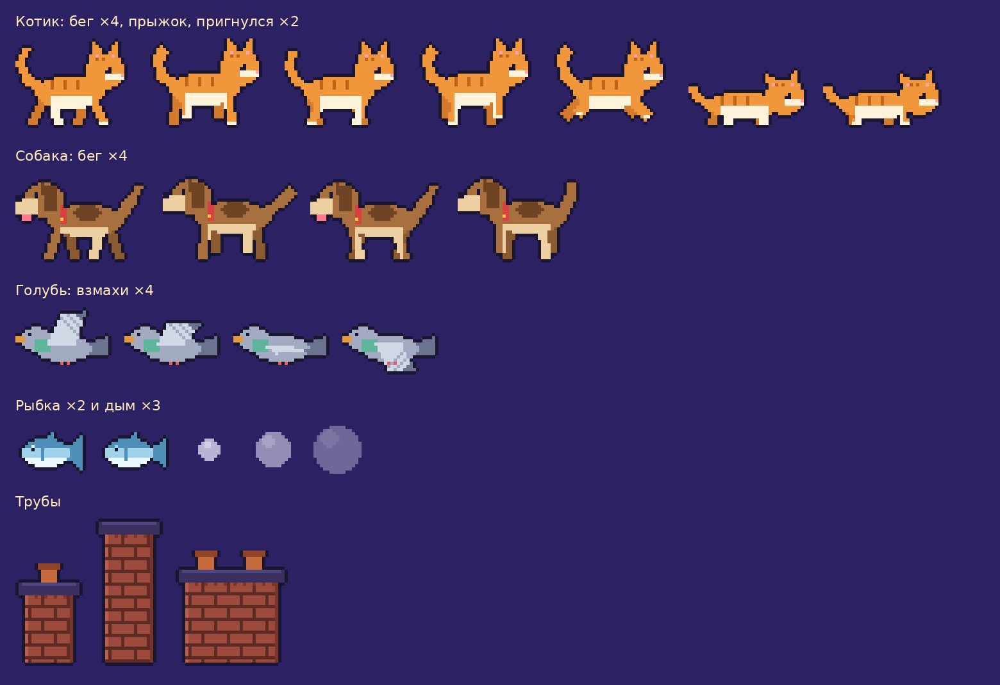

# CatRoof: котик на крыше

Пиксельный бесконечный раннер в духе «динозаврика» из Chrome. Рыжий котик бежит по крышам ночного города, перепрыгивает трубы, уворачивается от собак и голубей и собирает рыбок. Игра написана на чистом JavaScript и HTML5 Canvas, без фреймворков, сборщиков и зависимостей.



## Особенности

- **Разрешение 320 на 180** с целочисленным масштабированием и `image-rendering: pixelated`. Картинка остаётся чёткой на любом экране.
- **Параллакс из шести слоёв**: небо, облака, дальний и средний город, ближние крыши, земля. Каждый слой движется со своей скоростью.
- **Шесть типов препятствий** с разным весом появления: три вида труб (короткая, высокая, двойная), собака, низкий и высокий голубь. Сложные препятствия открываются по мере пройденного расстояния.
- **Растущая сложность**: скорость линейно увеличивается со временем до предельного значения.
- **Бонусы**: рыбка приносит +100 очков и отображается всплывающей надписью.
- **Отзывчивая физика прыжка**: короткое нажатие даёт низкий прыжок, удержание даёт высокий. Клавиша «вниз» в воздухе ускоряет падение.
- **Дым из труб**: анимированные клубы с затуханием.
- **Собственный растровый шрифт** с поддержкой кириллицы и латиницы, тонировка глифов кешируется.
- **Рекорд сохраняется** в `localStorage` между сессиями.
- **Поддержка мобильных устройств**: управление тапом, автоматический полноэкранный режим и блокировка ориентации в альбомную.
- **Детерминированный игровой цикл**: шаг времени ограничен сверху, состояние обновляется иммутабельно.

## Управление

| Действие | Клавиатура | Сенсорный экран / мышь |
|---|---|---|
| Старт / прыжок / заново | `Пробел`, `Стрелка вверх`, `W` | Тап или клик |
| Пригнуться / ускорить падение | `Стрелка вниз`, `S` | Нет |
| Полноэкранный режим | `F` | Первое касание включает автоматически |

Высота прыжка зависит от длительности удержания клавиши. После проигрыша перезапуск доступен через полсекунды, это защищает от случайного нажатия.

## Подсчёт очков

- Каждые 10 пикселей пройденного пути дают 1 очко.
- Каждая пойманная рыбка даёт 100 очков. Количество рыбок отображается отдельно в левом верхнем углу.
- Лучший результат показывается в правом верхнем углу и сохраняется локально в браузере.

## Запуск

Игра использует ES-модули и `await` верхнего уровня, поэтому её нужно открывать через HTTP-сервер, а не напрямую как файл. Подойдёт любой статический сервер:

```bash
# Python 3
python -m http.server 8080
```

```bash
# Node.js
npx serve .
```

Затем откройте `http://localhost:8080` в браузере.

**Требования к браузеру**: поддержка ES-модулей, top-level `await` и Fullscreen API (Chrome 89+, Firefox 89+, Safari 15+, Edge 89+).

Установка зависимостей и сборка не нужны.

## Структура проекта

```
CatRoof/
├── index.html          # Точка входа, canvas 320 на 180
├── style.css           # Центровка, тёмный фон, отключение жестов браузера
├── background/         # Слои параллакса (PNG)
├── sprites/            # Спрайт-листы персонажей, препятствий, шрифта
└── src/
    ├── main.js         # Инициализация и игровой цикл (requestAnimationFrame)
    ├── config.js       # Все константы: физика, размеры, хитбоксы, препятствия, цвета
    ├── game.js         # Состояние игры и переходы между фазами ready, playing, over
    ├── cat.js          # Физика и анимация котика
    ├── obstacles.js    # Генерация, движение препятствий, дым и всплывающие очки
    ├── collide.js      # AABB-столкновения
    ├── render.js       # Отрисовка сцены, HUD и панелей
    ├── draw.js         # Примитивы: параллакс-полосы, кадры спрайт-листов
    ├── font.js         # Растровый шрифт с тонировкой и тенью
    ├── input.js        # Клавиатура и указатель, буферизация нажатий
    ├── storage.js      # Чтение и запись рекорда в localStorage
    ├── viewport.js     # Масштабирование canvas и полноэкранный режим
    └── assets.js       # Асинхронная загрузка изображений
```

## Архитектура

Игра построена по принципу разделения состояния, обновления и отрисовки:

1. **Состояние**. Обычный объект, который создаётся в `createState` и никогда не мутируется. Каждый кадр функция `update` возвращает новый объект.
2. **Обновление**. Чистая функция от состояния, времени `dt` и снимка ввода. Шаг времени ограничен 50 мс, чтобы после сворачивания вкладки котик не «проваливался» сквозь препятствия.
3. **Отрисовка**. Функция `render` читает состояние и рисует сцену послойно: небо и параллакс, трубы за землёй, земля, остальные препятствия, дым, котик, всплывающие очки, HUD, оверлеи.

Такое разделение упрощает отладку: любое состояние можно сериализовать, воспроизвести и отрисовать независимо от игрового цикла.

## Настройка

Все игровые параметры собраны в [src/config.js](src/config.js). Наиболее полезные для баланса:

| Константа | Назначение | Значение |
|---|---|---|
| `GRAVITY` | Ускорение свободного падения, px/s^2 | 700 |
| `JUMP_V` | Начальная скорость прыжка, px/s | 308 |
| `JUMP_CUT` | Доля скорости при раннем отпускании кнопки | 0.45 |
| `FAST_FALL` | Гравитация при нажатой «вниз» в воздухе | 1500 |
| `SPEED_START` / `SPEED_MAX` | Начальная и предельная скорость, px/s | 110 / 600 |
| `SPEED_ACCEL` | Прирост скорости в секунду | 6 |
| `GAP_MIN_S` / `GAP_MAX_S` | Интервал между препятствиями, секунды | 0.95 / 1.7 |
| `FISH_CHANCE` | Вероятность появления рыбки вместо препятствия | 0.18 |
| `FISH_POINTS` | Очки за рыбку | 100 |

Чтобы добавить новое препятствие, достаточно положить спрайт в `sprites/`, зарегистрировать его в `IMAGES` и описать в массиве `OBSTACLES`: размеры, хитбокс, высоту появления, параметры анимации, вес и минимальную дистанцию, с которой оно начинает встречаться.

## Ресурсы

Все графические материалы выполнены в пиксель-арте в формате PNG. Спрайт-листы горизонтальные: кадры одинаковой ширины идут слева направо. Растровый шрифт `sprites/font.png` содержит цифры, кириллицу, латиницу и знаки препинания. Порядок символов задан в `FONT_CHARS`.
